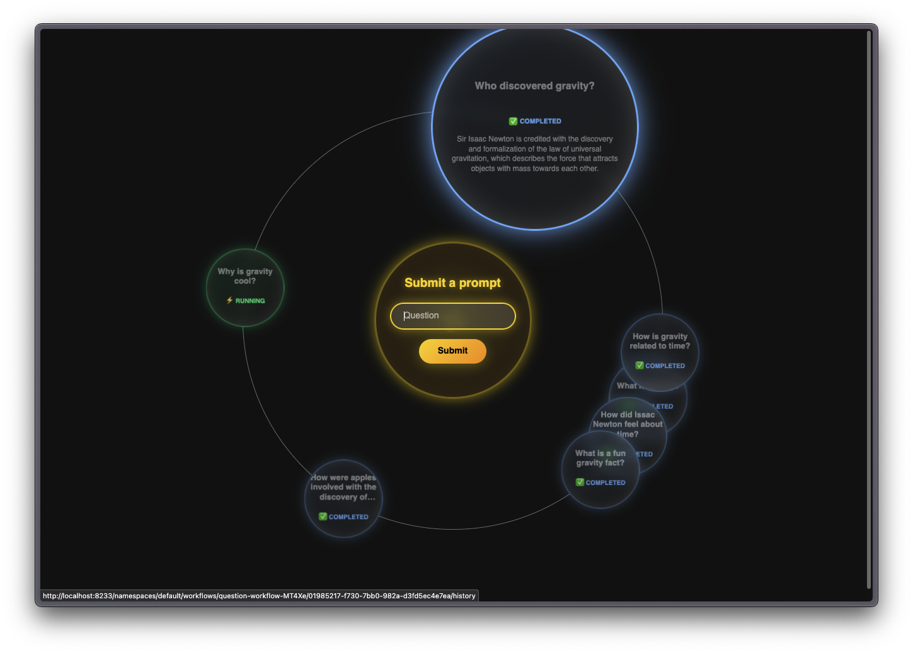
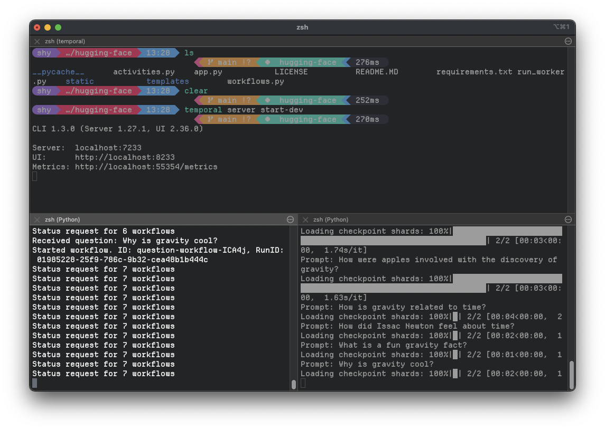
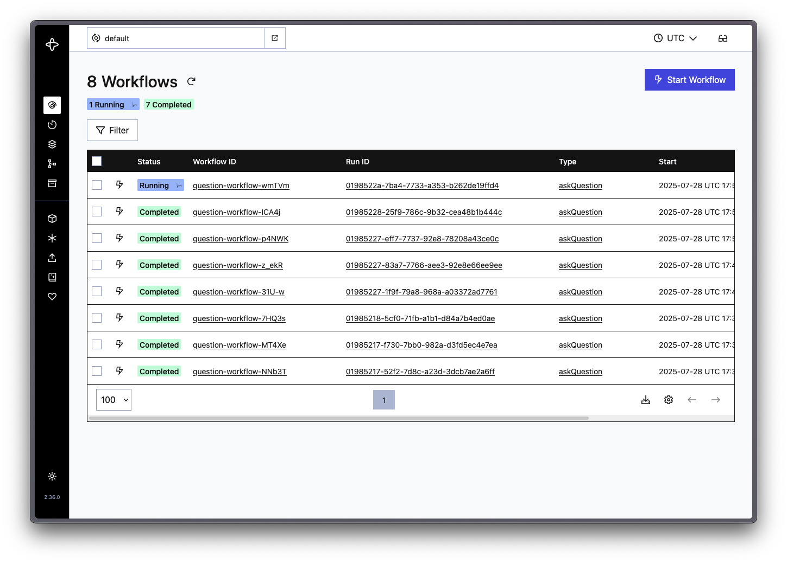

# Temporal Hugging Face Example.

This is an example implementation of running a hugging face model using Temporal activties and workers. Our page is using websockets to communicate updates back and forth between our flask server, and our client browser. By leveraging temporal we get automatic job queueing and execution in addition to retries, timeout management, question status tracking and more.



### How this project works:

```
┌─────────────────┐    ┌─────────────────┐    ┌─────────────────┐
│   Flask App     │    │  Temporal       │    │  Worker         │
│                 │◄──►│  Server         │◄──►│  (AI Model)     │
│                 │    │                 │    │                 │
│ • Web Interface │    │ • Workflow      │    │ • SmolLM3-3B    │
│ • WebSockets    │    │   Queue         │    │ • Inference     │
│ • Status Updates│    │ • Job Management│    │ • Retry Logic   │
└─────────────────┘    └─────────────────┘    └─────────────────┘
```

- This project has 3 major components that communicate with each other.
  - The flask app manages our frontend, pushes out updates to a browser using websockets, and creates new workflows to be coordinated by our temporal server.
  - The Temporal server assigns work to our worker, manages the queue, handles retries and more.
  - Our worker, executes our hugging face model and returns the results of our questions.

The specfic files include:

- **Flask Application** ([`app.py`](app.py)): Web server handling HTTP requests and WebSocket connections
- **Temporal Workflows** ([`workflows.py`](workflows.py)): Defines the workflow structure with retry policies.
- **Activities** ([`activities.py`](activities.py)): Handles the actual AI model inference logic
- **Worker** ([`run_worker.py`](run_worker.py)): Temporal worker that processes queued workflows
- **Frontend** (`templates/`, `static/`,): Frontend that leverages the [orbit css framework](https://github.com/zumerlab/orbit) to create the circular layout and [clientside javascript](static/app.js) to communicated with the flask server using websockets to update the page as information is returned from our worker.

# Getting started

### Requirements

To deploy this project you'll need the following installed on your system:

- [Temporal CLI](https://temporal.io/setup/install-temporal-cli)
- [Python 3](https://github.com/pyenv/pyenv)

Given that we're downloading a hugging face model and executing it local the better CPU and memory you have, the faster it'll perform. On my M4, each question takes me about 10ish seconds to generate a response.

### Setup

- Clone this repository.
- Create a virtual enviorment and install the dependencies from [requirements.txt](requirements.txt).
  - This project was built using python 3.13.5 so default to that version if you encounter any issues.
- Start a local temporal server.
  - `temporal server start-dev`
- Create at least one temporal worker.
  - `python run_worker.py`
- Start the flask server.
  - `python app.py`



This will start up a flask app with a UI for asking our hugging face model questions on [port 5000](localhost://5000). For this demo we're using the recently rellected [SmolLM3](https://huggingface.co/HuggingFaceTB/SmolLM3-3B). The first time you ask it a question, this will take a bit of time as we need to download and cache SmolLM3. Afterwards each question should only take a few seconds.



You're able to ask as many questions as you'd like and can navigate to the temporal UI running on [port 8233](localhost://8233) to view the status of the queue. You can navigate to a specfic task queue by clicking on the question from our flask UI. From the temporal UI, you can restart, terminate or just view the status of any specfic workflow.
